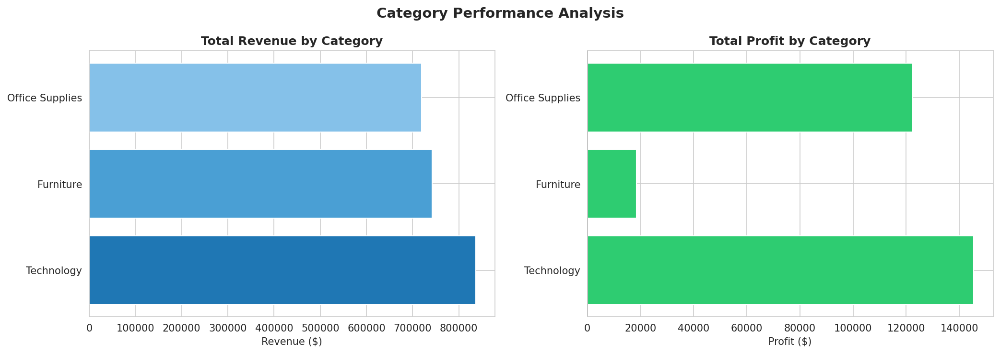
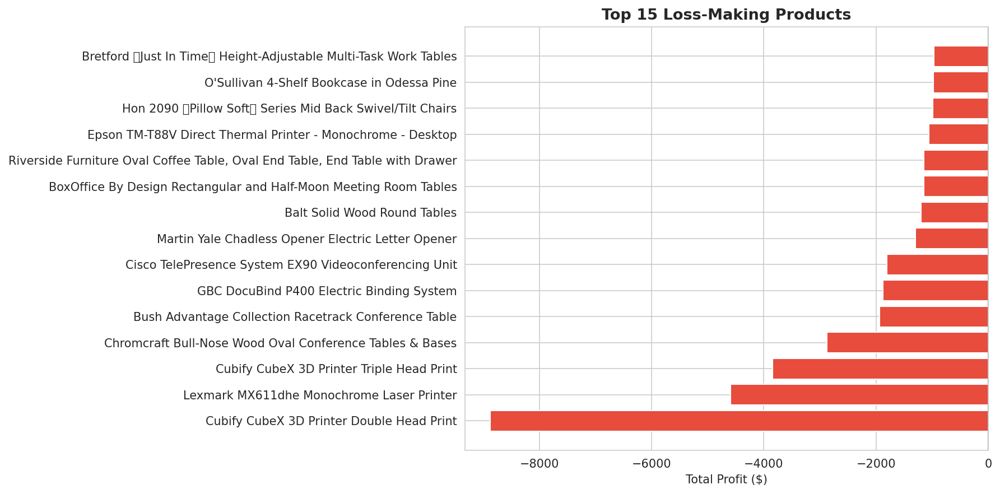
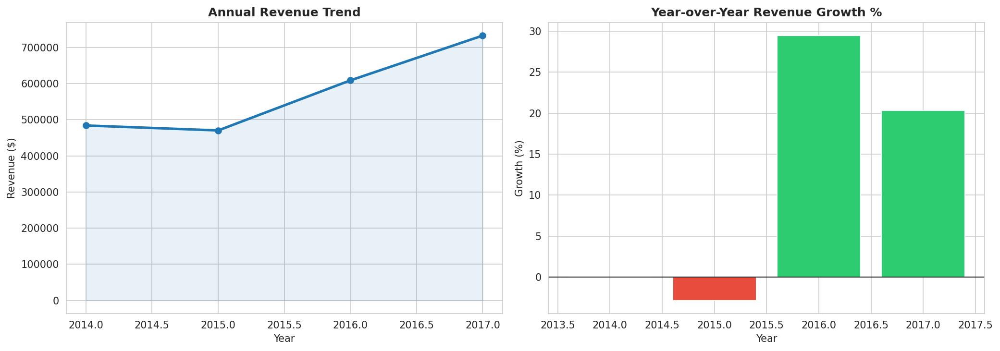
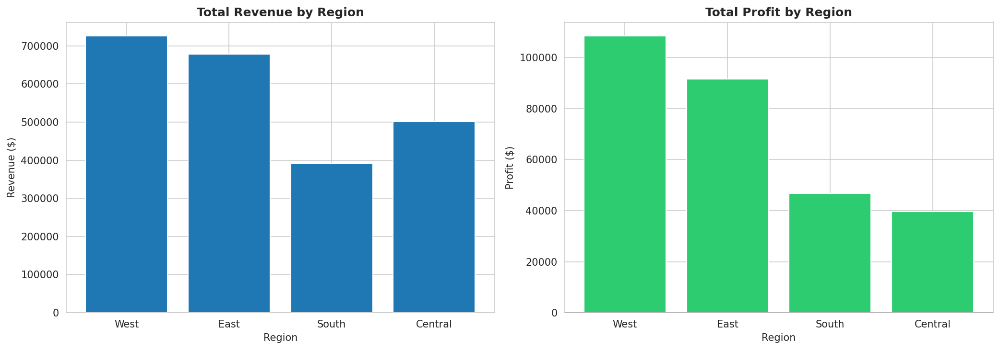
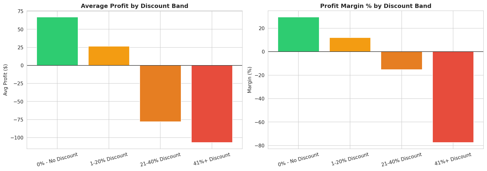

# Retail Sales Intelligence Project

**Author:** Aziz Iben Hadj Abdallah | **Year:** 2025

---

## Why I Built This

During my BI studies I kept seeing dashboards that looked good but didn't really 
explain anything. I wanted to build something that goes deeper — not just charts, 
but actual answers to real business problems.

I picked a retail dataset and asked myself: why is this business not more profitable? 
That question drove the entire analysis.

---

## What I Found

The business generates $2.3M in revenue but only keeps 12.47% as profit. I traced 
the root cause through 4 layers of analysis:

- **Furniture is a problem** — 2.49% margin despite being the 2nd highest revenue category
- **Some products lose money on every sale** — the worst lost $8,879 on $11K in revenue
- **Heavy discounting is the real culprit** — orders with 40%+ discount have -77% margin
- **Central region underperforms** — 7.92% margin vs 14.94% in the West

These findings connect. The discount problem explains the furniture problem which 
explains the Central region problem.

---

## What I Recommended

1. Cap discounts at 20% — anything above destroys margin completely
2. Review the Machines and Tables sub-categories for discontinuation
3. Investigate Central region pricing strategy specifically
4. Focus growth efforts on Technology — highest margin at 17.4%

---

## Tools I Used

- Python + SQL — to explore and analyze the data
- Matplotlib / Seaborn — to visualize findings
- Power BI — interactive dashboard (coming in Week 2)

---

## Screenshots

### Category Performance

### Loss-Making Products

### Sales Trend

### Regional Performance

### Discount Impact

---

## Data Source
[Superstore Dataset — Kaggle](https://www.kaggle.com/datasets/vivek468/superstore-dataset-final)
